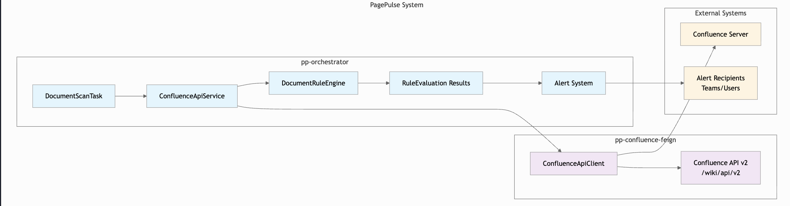

# PagePulse
A configurable, automated auditing service designed to keep Confluence spaces healthy, accurate, and up to date. It continuously monitors pages across specified spaces and tags, evaluates their last published or updated timestamp, and alerts teams when content becomes stale.

[](https://codecov.io/gh/lewisjones28/PagePulse)

## 🏗️ Architecture



PagePulse is built as a multi-module Spring Boot application with a microservices architecture:

- **pp-orchestrator**: Core business logic module that coordinates auditing workflows and processes
- **pp-confluence-feign**: Feign client module for seamless integration with Atlassian Confluence APIs

## ✨ Key Features

- **Automated Page Monitoring**: Continuously scans Confluence spaces for content freshness
- **Configurable Auditing Rules**: Set custom thresholds for page staleness based on your team's needs
- **Space & Tag Filtering**: Target specific Confluence spaces and pages with particular tags
- **Stale Content Detection**: Intelligent analysis of page creation and modification timestamps
- **Team Notifications**: Automated alerts when pages require attention or updates
- **RESTful API**: Clean endpoints for integration with other tools and workflows

## 🚀 Getting Started

### Prerequisites

- Java 25
- Spring Boot 3.3+
- Maven 3.6+
- Access to a Confluence instance with API permissions

## Environment Variables

Set the following environment variables before running the application:

```bash
export CONFLUENCE_BASE_URL=https://your-confluence-instance.com
export CONFLUENCE_USERNAME=your-username
export CONFLUENCE_API_TOKEN=your-api-token
```

---

## Running the Application

### 1. Clone the repository:

```bash
git clone <repository-url>
cd PagePulse
```

### 2. Build the project:

```bash
mvn clean install
```

### 3. Run the orchestrator service:

```bash
cd pp-orchestrator
mvn spring-boot:run
```

---

## Running Tests

Execute the test suite across all modules:

```bash
mvn test
```

Generate test coverage reports:

```bash
mvn jacoco:report
```

---

## 📋 Configuration

### Application Configuration

The main configuration file is located at:

```
pp-orchestrator/src/main/resources/application.yml
```

Example:

```yaml
confluence:
  base-url: ${CONFLUENCE_BASE_URL}
  username: ${CONFLUENCE_USERNAME}
  api-token: ${CONFLUENCE_API_TOKEN}
```

### Auditing Rules

Configure auditing parameters through `application.yml` or REST endpoints:

- **Staleness Threshold** – Define how old a page must be to be flagged as stale
- **Space Filters** – Specify which Confluence spaces to monitor
- **Tag Filters** – Target pages with specific labels or tags
- **Notification Settings** – Configure alert recipients and frequency

---

## 🔍 Code Quality

This project maintains high code quality standards using:

- **Checkstyle** — Enforced coding standards (`checkstyle.xml`)
- **JaCoCo** — Test coverage reporting and aggregation
- **MapStruct** — Type-safe DTO mapping
- **Spring Boot Actuator** — Production-ready monitoring endpoints

### Code Style

Before committing, ensure your changes follow the project's Checkstyle rules:

```bash
mvn validate
```

---

## 📊 Monitoring

PagePulse includes Spring Boot Actuator for real-time monitoring:

- **Health checks:** `/actuator/health`
- **Metrics:** `/actuator/metrics`
- **Application info:** `/actuator/info`

## To Do
- [ ] `Document` changes
  - [ ] Internal `lastUpdated` field
  - [ ] Cache in Redis
- [ ] Cache Confluence API responses into Redis
- [ ] Implement notification system (e.g., email, Slack) for Rule violations
- [ ] New Rule Ideas
  - [ ] Missing Label Rule - Identify pages lacking specific labels (https://diataxis.fr/)
  - [ ] Deactivated Owner Rule - Flag pages owned by deactivated users