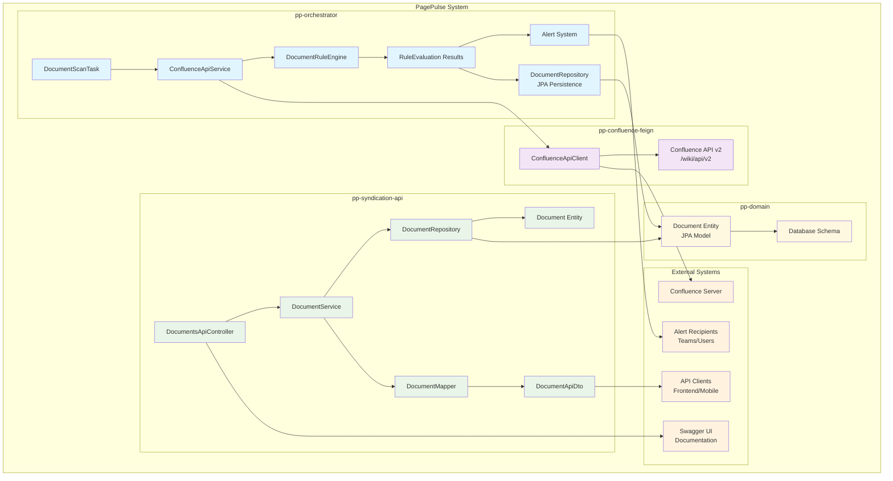

```mermaid
graph TB
subgraph "PagePulse System"
    subgraph "pp-orchestrator"
        A[DocumentScanTask] --> B[ConfluenceApiService]
        B --> C[DocumentRuleEngine]
        C --> D[RuleEvaluation Results]
        D --> E[Alert System]
        D --> J[DocumentRepository<br/>JPA Persistence]
    end

    subgraph "pp-confluence-feign"
        F[ConfluenceApiClient] --> G[Confluence API v2<br/>/wiki/api/v2]
    end
    
    subgraph "pp-syndication-api"
        K[DocumentsApiController] --> L[DocumentService]
        L --> M[DocumentRepository]
        M --> N[Document Entity]
        L --> O[DocumentMapper]
        O --> P[DocumentApiDto]
    end
    
    subgraph "pp-domain"
        Q[Document Entity<br/>JPA Model]
        R[Database Schema]
    end
    
    subgraph "External Systems"
        H[Confluence Server]
        I[Alert Recipients<br/>Teams/Users]
        S[API Clients<br/>Frontend/Mobile]
        T[Swagger UI<br/>Documentation]
    end
end

B --> F
F --> H
E --> I
J --> Q
M --> Q
Q --> R
P --> S
K --> T

classDef orchestrator fill:#e1f5fe
classDef feign fill:#f3e5f5
classDef syndication fill:#e8f5e8
classDef domain fill:#fff8e1
classDef external fill:#fff3e0

class A,B,C,D,E,J orchestrator
class F,G feign
class K,L,M,N,O,P syndication
class Q,R domain
class H,I,S,T external
```
