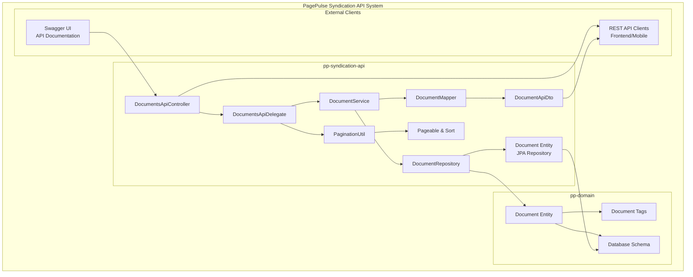

```mermaid
graph TB
subgraph "PagePulse Syndication API System"
    subgraph "pp-syndication-api"
        A[DocumentsApiController] --> B[DocumentsApiDelegate]
        B --> C[DocumentService]
        C --> D[DocumentRepository]
        D --> E[Document Entity<br/>JPA Repository]
        C --> F[DocumentMapper]
        F --> G[DocumentApiDto]
        B --> H[PaginationUtil]
        H --> I[Pageable & Sort]
    end

    subgraph "pp-domain"
        J[Document Entity] --> K[Document Tags]
        J --> L[Database Schema]
    end
    
    subgraph "External Clients"
        M[REST API Clients<br/>Frontend/Mobile]
        N[Swagger UI<br/>API Documentation]
    end
end

A --> M
D --> J
E --> L
G --> M
N --> A

class A,B,C,D,E,F,G,H,I syndicationapi
class J,K,L domain
class M,N external
```
