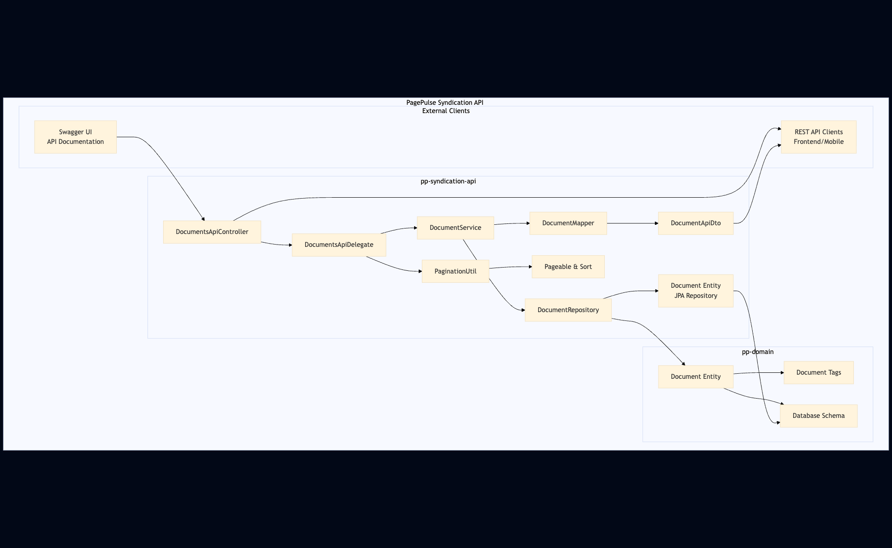

# pp-syndication-api

Syndication API for **PagePulse**.

This module exposes a read-only REST API (generated from an OpenAPI spec) for consuming PagePulse data (currently: **Documents**).

- OpenAPI spec source: `src/main/resources/openapispec.yaml`
- Code generation: `openapi-generator-maven-plugin` (Spring server)
- Persistence: JPA (entities from `pp-domain`)

## Architecture Overview



## Endpoints

### Documents

- `GET /documents`
  - Query params:
    - `page` (default `0`)
    - `size` (default `10`)
    - `sort` (repeatable)
      - Supports either:
        - `sort=title,asc`
        - or repeated tokens: `sort=title&sort=asc`

Response schema:

- `PagedDocumentApiDto`
  - `content`: list of `DocumentApiDto`
  - `pageInfo`:
    - `page`: current page
    - `pages`: total pages
    - `elements`: total elements

## Running locally

This service is configured to connect to the **same MySQL database** as the orchestrator by default.

`src/main/resources/application.yml` uses:

- `SPRING_DATASOURCE_URL` (default: `jdbc:mysql://localhost:3306/page_pulse`)
- `SPRING_DATASOURCE_USERNAME` (default: `root`)
- `SPRING_DATASOURCE_PASSWORD` (default: empty)

The service runs on port **8089**.

## Swagger / OpenAPI UI

Swagger UI is served by `springdoc-openapi`.

- `springdoc.swagger-ui.path: /swagger-ui.html`

…the UI will be reachable at:

- Swagger UI: `http://localhost:8089/swagger-ui/index.html`
- OpenAPI JSON: `http://localhost:8089/api-docs`

## Build

From the repo root:

```bash
mvn clean install
```

Or to build just this module:

```bash
mvn -pl pp-syndication-api clean install
```

## Tests

This module includes:

- Unit tests for mapper/service/util components
- A MockMvc integration test (`DocumentsApiImplTest`) using H2 in-memory DB via `src/test/resources/application-test.yml`

Run:

```bash
mvn -pl pp-syndication-api test
```

## Notes / Generated code

OpenAPI Generator writes sources into:

- `target/generated-sources/openapi`
